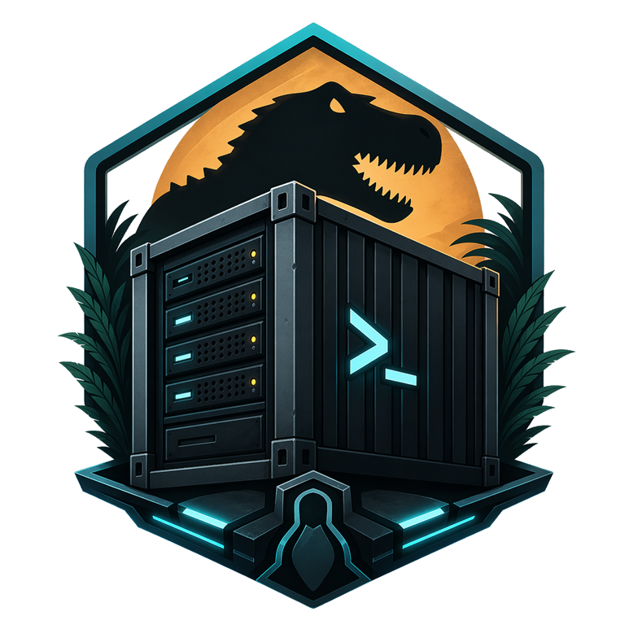

<p align="center">
  
</p>

# ARK: Survival Ascended Linux Server

Run an ARK: Survival Ascended dedicated server on Linux with Docker Compose.
The image handles game updates, GE-Proton setup and server supervision. The
included `asa-ctrl` tool provides RCON, mod management and scheduled restarts
using only the Python standard library.

## Quick start

Install Docker with Compose, then run:

```bash
mkdir asa-server && cd asa-server
wget https://raw.githubusercontent.com/JustAmply/ark-survival-ascended-server/main/docker-compose.yml
wget https://raw.githubusercontent.com/JustAmply/ark-survival-ascended-server/main/.env.example
cp .env.example .env
vi .env
```

Set a unique `ASA_SERVER_ADMIN_PASSWORD` in `.env` and keep that file private.
The supplied Compose file requires a non-empty password.

```bash
docker compose up -d
docker compose logs -f asa-server-1
```

The first start downloads the server files and compatibility tools. Wait for
game startup to complete, then look in the **Unofficial** server browser with
**Show Player Servers** enabled. See the [setup guide](SETUP.md) for network
configuration, storage and server settings.

## Features

- Automatic game updates on startup, with full validation on the first install.
- RCON administration and dynamic mod management.
- Multi-server clusters with shared transfer storage.
- Scheduled restarts with chat warnings and `saveworld`.
- Persistent game files, saves and downloaded tools in Docker volumes.
- ServerAPI plugin loader detection.

Configure the map, ports, player limit and other settings through individual
`ASA_*` environment variables in Compose. Existing `ASA_START_PARAMS` launch
strings remain supported, including in combination with those variables;
precedence is `ASA_EXTRA_*` > named `ASA_*` > `ASA_START_PARAMS` > defaults.
The [configuration reference](SETUP.md#server-configuration) lists the options.
After changing Compose settings, use `docker compose up -d -t 300` to apply them
with time for saving and shutdown.

## Architectures

`ghcr.io/justamply/asa-linux-server:latest` is the stable AMD64 image.
ARM64 hosts use `ghcr.io/justamply/asa-linux-server:arm64-experimental`.

ARM64 uses FEX to translate SteamCMD and Proton. It remains experimental:
translation and lifecycle checks do not establish that ARK will start, save and
run reliably on your host. Follow the [ARM64 setup notes](SETUP.md#arm64-experimental)
and test the game on the target host before relying on it.

## Documentation

| Document | Purpose |
| --- | --- |
| [Setup and administration](SETUP.md) | Installation, configuration, volumes, mods, RCON and restarts |
| [Troubleshooting](FAQ.md) | Server visibility, connection failures and startup errors |
| [Development](docs/development.md) | Local tests, installed-package checks, image checks and CI |
| [Domain model](CONTEXT.md) | Terms and ownership of runtime and configuration contracts |
| [Configuration decision](docs/adr/0001-discrete-environment-configuration.md) | Why discrete variables overlay the legacy launch line |
| [ARM64 decision](docs/adr/0002-isolated-arm64-translation.md) | Translation isolation, package policy and shutdown design |

## Support and credits

Report bugs through [GitHub Issues](https://github.com/JustAmply/ark-survival-ascended-server/issues)
and ask questions in [GitHub Discussions](https://github.com/JustAmply/ark-survival-ascended-server/discussions).

This project rewrites the original Ruby tools in dependency-free Python.
Thanks to [mschnitzer](https://github.com/mschnitzer/ark-survival-ascended-linux-container-image)
for the original image, [GloriousEggroll](https://github.com/GloriousEggroll/proton-ge-custom)
for GE-Proton, and [cdp1337](https://github.com/cdp1337/ARKSurvivalAscended-Linux)
for Linux installation guidance.
